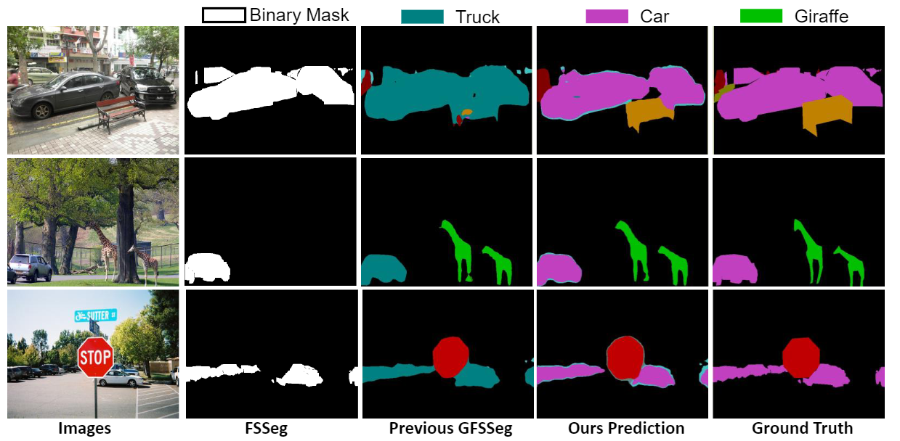

# GFS-Seg
This is part implementation of [**Harmonizing Base and Novel Classes: A Class-Contrastive Approach for Generalized Few-Shot Segmentation**](https://link.springer.com/article/10.1007/s11263-023-01939-y) (IJCV 2023). 




### Datasets and Data Preparation
The training configurations for Pascal-VOC and MS COCO datasets adhere to the standards established in the original CAPL methodology(https://github.com/dvlab-research/GFS-Seg).

This code reads data from .txt files where each line contains the paths for image and the correcponding label respectively. Image and label paths are seperated by a space. Example is as follows:

    image_path_1 label_path_1
    image_path_2 label_path_2
    image_path_3 label_path_3
    ...
    image_path_n label_path_n

Then update the train/val list paths in the config files.


### Train / Evaluate
+ For training, please set the option **only_evaluate** to **False** in the configuration file. Then execute this command at the root directory: 

    sh train.sh {*dataset*} {*model_config*}
    
+ For evaluation only, please set the option **only_evaluate** to **True** in the corresponding configuration file. 

    
Example: Train / Evaluate CAPL with 1-shot on the split 0 of PASCAL-5i: 

    sh train.sh pascal split0_1shot   
    

## Related Assets \& Acknowledgement

Our work is closely related to the following assets that inspire our implementation. We gratefully thank the authors. 
+ CAPL: https://github.com/dvlab-research/GFS-Seg

# Citation

If you find this project useful, please consider citing:
```
@article{liu2023harmonizing,
  title={Harmonizing Base and Novel Classes: A Class-Contrastive Approach for Generalized Few-Shot Segmentation},
  author={Liu, Weide and Wu, Zhonghua and Zhao, Yang and Fang, Yuming and Foo, Chuan-Sheng and Cheng, Jun and Lin, Guosheng},
  journal={International Journal of Computer Vision},
  year={2023},
  publisher={Springer}
}
```

## TO DO
* Full implementation of the code in the paper.
* Code refactoring
